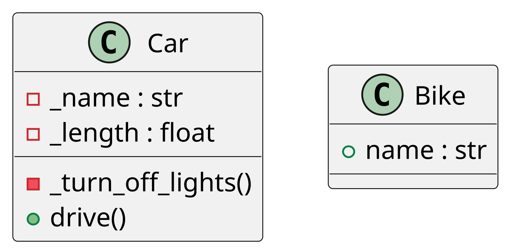

## Welcome to pdgen Documentation

Discover how `pdgen` can transform your Python code into comprehensive UML class diagrams with ease. Our tool is
designed to help developers understand complex code bases through visual representation.

### Why pdgen?

- **Simplify Complex Code**: Visualize relationships and structures within your code that might be difficult to
  interpret from text alone.
- **Improve Code Quality**: Identify design issues and improve your software architecture through better understanding
  of code dependencies.
- **Enhance Collaboration**: Share clear and concise UML diagrams with your team members, enhancing both communication
  and collaboration.

### Getting Started

Install pdgen via pip:

```bash
pip install pdgen
```

Here’s how you can use PDGen to generate a UML diagram:

```python
from pdgen import include_in_uml, generate_diagram

@include_in_uml
class Bike:
    def __init__(self, name: str):
        self.name = name


@include_in_uml
class Car:
    _name: str
    _length: float

    def get_name(self) -> str:
        return self._name

    @include_in_uml
    def drive(self):
        pass

    @include_in_uml
    def _turn_off_lights(self) -> None:
        pass

generate_diagram(Path("diagram_new.png"), Path("diagram_new.txt"))
```

### Output

1. **`diagram_new.png`**: An UML diagram image PNG
2. **`diagram_new.txt`**: The PlantUML source text for the diagram.

### Example UML Diagram

The generated UML diagram includes the annotated classes and methods:




### Created by

Created by [Softoft](https://softoft.de/)

## Installation

Installing `pdgen` is straightforward. This page will guide you through the process of getting `pdgen` set up on your
system so you can start generating UML class diagrams from your Python code.

### Prerequisites

Before you install `pdgen`, ensure you meet the following requirements:

- Python 3.12 or newer
- pip (Python package installer)

### Installing pdgen

You can install `pdgen` using pip, Python's package manager. Open your terminal and run the following command:

```bash
pip install pdgen
```

This command will download and install the latest version of `pdgen` and all required dependencies.

### Troubleshooting

If you encounter any issues during the installation, here are a few common problems and solutions:

- **Permission Errors**: If you receive a permission error, try installing `pdgen` with administrative privileges or use
  a virtual environment.

  ```bash
  sudo pip install pdgen
  ```

- **Dependency Conflicts**: If there are conflicts with existing packages, consider installing `pdgen` in a virtual
  environment using `venv` or `conda`.

  ```bash
  python -m venv pdgen-env
  source pdgen-env/bin/activate
  pip install pdgen
  ```

## Usage Guide

Here’s how you can use PDGen to generate a UML diagram:

```python
import logging
from pathlib import Path

# Configure logging to see debug output
logging.basicConfig(level=logging.DEBUG)

from pdgen import include_in_uml, generate_diagram
from dataclasses import dataclass

@include_in_uml
class Bike:
    def __init__(self, name: str):
        self.name = name


@include_in_uml
@dataclass
class Car:
    _name: str
    _length: float

    def set_name(self, name: str) -> None:
        self._name = name

    def get_name(self) -> str:
        return self._name

    @include_in_uml
    def drive(self):
        pass

    @include_in_uml
    def get_fuel_level(self) -> float:
        pass

    @include_in_uml
    def _turn_off_lights(self) -> None:
        pass

if __name__ == '__main__':
    # Generate a UML diagram
    generate_diagram(Path("diagram_new.png"), Path("diagram_new.txt"))
```

### Output

The above script generates:

1. **`diagram_new.png`**: A UML diagram image.
2. **`diagram_new.txt`**: The PlantUML source text for the diagram.

### Example UML Diagram

The generated UML diagram includes the annotated classes and methods:


```
@startuml
skinparam dpi 600

class Car {
    - _name : str
    - _length : float
    - _turn_off_lights()
    + drive()
    + get_fuel_level()
}


class Bike {
    + name : str
}

@enduml
```

## API Reference

### `@include_in_uml`

A decorator used to mark classes or methods for inclusion in the UML diagram.

### `generate_diagram(output_path: Path, uml_text_path: Path)`

Generates a UML diagram and optionally saves the PlantUML source.

- **`output_path`**: Path to save the generated UML diagram (e.g., PNG format).
- **`uml_text_path`**: Path to save the PlantUML source text.

### Logging

PDGen uses Python's `logging` module to output debug information. You can configure the logging level in your script for
better insights into the generation process.

```python
import logging
logging.basicConfig(level=logging.DEBUG)
```

## Pdgen - Python UML Generator - Planned Features

:::warning
This is a work in progress. These are just ideas for future versions!
:::

### Configuration

`pdgen` is designed to be flexible and customizable to fit various development environments and preferences. This page
explains how to configure `pdgen` to optimize its functionality for your projects.

#### Basic Configuration

Upon installation, `pdgen` works out of the box with default settings that are suitable for most projects. However, you
can customize these settings to better fit your specific needs.

##### Setting Output Directory

You can specify the directory where the generated UML diagrams should be saved:

```python
pdgen --output-directory /path/to/your/directory
```

##### Diagram Customization

`pdgen` allows you to customize the appearance of the generated diagrams. You can specify colors, fonts, and line
styles:

```python
pdgen --color-scheme dark --font Arial --line-style dotted
```

#### Advanced Configuration

:::warning
This is a work in progress. These are just ideas for future versions!
:::

For users who need more control over the generation process, `pdgen` offers several advanced configuration options.

##### Include Private Methods

By default, `pdgen` does not include private methods in the diagrams. To include them, use the following flag:

```python
pdgen --include-private
```

##### Filter Classes

If you want to generate diagrams for specific classes, you can use the filter option to specify which classes to
include:

```python
pdgen --filter "Class1,Class2"
```

#### Configuration File

Instead of passing options through the command line every time, you can create a configuration file named
`pdgen.config.json` and store your preferences there:

```json
{
  "outputDirectory": "/path/to/your/directory",
  "colorScheme": "dark",
  "font": "Arial",
  "lineStyle": "dotted",
  "includePrivate": true,
  "filter": [
    "Class1",
    "Class2"
  ]
}
```

Use the configuration file by specifying it when running `pdgen`:

```python
pdgen --config pdgen.config.json
```

#### Tips for Effective Configuration

- **Consistency**: Keep your configuration consistent across your team to ensure that everyone generates diagrams in the
  same style and format.
- **Version Control**: Consider versioning your configuration file along with your codebase to track changes over time.

#### Next Steps

:::warning
This is a work in progress. These are just ideas for future versions!
:::

`pdgen` offers a range of advanced features that enable users to handle complex scenarios and enhance the utility of the
generated UML diagrams. This section explores these capabilities and provides guidance on how to leverage them to their
fullest potential.

### Custom Diagram Themes

`pdgen` supports custom themes for diagrams, allowing users to tailor the visual style to match their organization's
branding or personal preference. You can define your theme settings in the configuration file:

```json
{
  "theme": {
    "backgroundColor": "#ffffff",
    "lineColor": "#000000",
    "textColor": "#333333",
    "highlightColor": "#ff0000"
  }
}
```

### Diagram Layout Options

To better manage the layout of complex diagrams, `pdgen` offers several layout algorithms:

- **Horizontal Layout**: Spreads classes horizontally, suitable for wide diagrams.
- **Vertical Layout**: Spreads classes vertically, ideal for deep inheritance hierarchies.

```python
pdgen --layout horizontal
```

### Integration with IDEs

:::warning
This is a work in progress. These are just ideas for future versions!
:::

`pdgen` can be integrated into popular Integrated Development Environments (IDEs) like Visual Studio Code or PyCharm.
This integration allows you to generate UML diagrams directly from the IDE, enhancing your workflow. For example, to set
up `pdgen` with Visual Studio Code, add the following extension settings:

```json
{
  "pdgen.enable": true,
  "pdgen.autoUpdate": true
}
```

### Command Line Scripting

`pdgen` can be used as part of automation scripts or CI/CD pipelines. You can script diagram generation for automated
documentation updates:

```bash
pdgen --auto-generate --watch /path/to/python/code
```

### Dynamic Diagrams

For projects that require dynamic updates to diagrams as code changes, `pdgen` supports live updating features, which
automatically regenerate diagrams when the source code changes.

```python
pdgen --live-update
```

### Collaborative Features

`pdgen` supports collaborative features, allowing teams to work together on the same diagrams. This includes sharing
settings and collaborative editing through a shared server setup.

```python
pdgen --collaborate --server-url "http://yourserver.com"
```