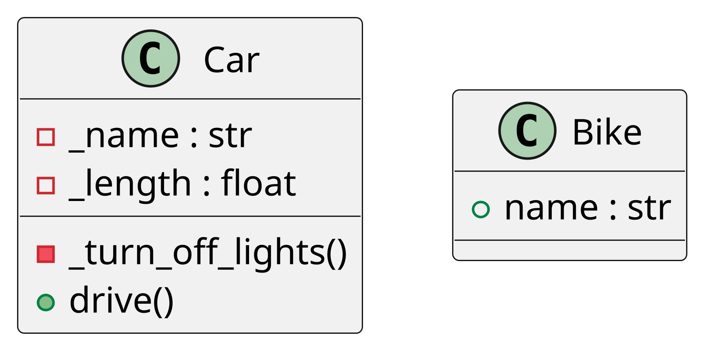

## Welcome to pdgen Documentation

Discover how `pdgen` can transform your Python code into comprehensive UML class diagrams with ease. Our tool is
designed to help developers understand complex code bases through visual representation.

### Why pdgen?

- **Simplify Complex Code**: Visualize relationships and structures within your code that might be difficult to
  interpret from text alone.
- **Improve Code Quality**: Identify design issues and improve your software architecture through better understanding
  of code dependencies.
- **Enhance Collaboration**: Share clear and concise UML diagrams with your team members, enhancing both communication
  and collaboration.

### Getting Started

Install pdgen via pip:

```bash
pip install pdgen
```

Here’s how you can use PDGen to generate a UML diagram:

```python
from pdgen import include_in_uml, generate_diagram

@include_in_uml
class Bike:
    def __init__(self, name: str):
        self.name = name


@include_in_uml
class Car:
    _name: str
    _length: float

    def get_name(self) -> str:
        return self._name

    @include_in_uml
    def drive(self):
        pass

    @include_in_uml
    def _turn_off_lights(self) -> None:
        pass

generate_diagram(Path("diagram_new.png"), Path("diagram_new.txt"))
```

### Output

1. **`diagram_new.png`**: An UML diagram image PNG
2. **`diagram_new.txt`**: The PlantUML source text for the diagram.

### Example UML Diagram

The generated UML diagram includes the annotated classes and methods:




### Created by

Created by [Softoft](https://softoft.de/)