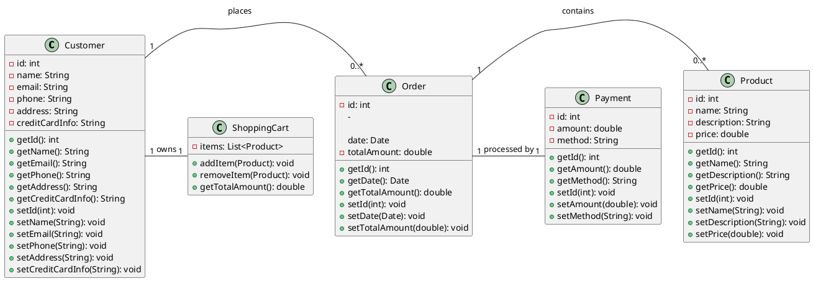

# Python UML Class Diagram Generation

## Learn how to create a class diagram from Python code and PlantUML


Discover the transformative power of [UML class diagrams](https://de.wikipedia.org/wiki/Klassendiagramm) in software development! In this article, we delve deep into the world of the Unified Modeling Language (UML), an indispensable tool for developers and system architects. You'll learn how to automatically generate UML diagrams from Python code, and we'll introduce you to best practices and the powerful tool [PlantUML](https://plantuml.com).

**UML class diagrams** provide a clear visual representation of a system's class structure, their attributes, methods, and the relationships between classes. These diagrams are essential for object-oriented design and help make complex systems understandable.

---

## What are UML Class Diagrams?

UML class diagrams are a type of structural diagram used to depict the layout and relationships of classes within a system. A class in a UML diagram is typically represented by a rectangle divided into three parts: class name at the top, attributes in the middle, and methods or operations at the bottom.

---

## Key Elements of a Class Diagram

- **Classes**: Represent the building blocks of the system.
- **Attributes**: Define the properties or data of a class.
- **Methods**: Functions or operations that a class can perform.
- **Relationships**: Represent various types of interactions between classes, such as associations, inheritances, or dependencies.

---

## Creating UML Class Diagrams with PlantUML

The creation of an effective UML class diagram starts with identifying the main classes of the system, followed by determining their attributes and methods. Next, the relationships between the classes are established. This process requires a deep understanding of the system being modeled and clear communication among team members.

A powerful tool for UML diagrams is PlantUML, an open-source tool that allows the creation of UML diagrams using simple text descriptions. With straightforward syntax, any UML diagram can be created, from class diagrams to sequence diagrams. PlantUML integrates seamlessly into various development environments, allowing developers to maintain their diagrams directly in the code, simplifying updates and version control.

### Defining Attributes and Methods


Classes have attributes and methods. Visibility specifies who can access an attribute/method. Visibility is indicated in a PlantUML diagram as follows:
- `-` private (class only)
- `~` protected (class and subclasses)
- `#` package-private (specific to Java: class and package)
- `+` public (all)
- `{static}` static (shared between all instances of the class)

### Relationships Between Classes


The following UML relationship types are written in PlantUML as:
- `A - B` Association
- `A o- B` Aggregation (A has B)
- `A *- B` Composition (A has B; B is part of A) B cannot exist without A
- `A ..> B` Dependency (A needs B)
- `class A extends B` Inheritance (A is a B)
- `class A implements B` Implementation (A can be B)

---

## Converting Python Code to UML

### Python Classes

Here is an example of how to create a standard Python class with attributes.

```python
class Car:
    def __init__(self, producer, model, engine):
        self.producer: str = producer
        self.model: Model = model
        self.engine: Engine = engine

    def start(self):
        pass

    def stop(self):
        pass
```

The `__init__` method in Python is the class constructor. What is `this` in other languages like Java, C#, JavaScript, etc., is `self` in Python. A reference to the instance itself.

In Python, visibilities like private, protected, and public are not directly supported; instead, there is a convention that private attributes and methods start with `__` and protected attributes start with `_`.

You can also create Enums in Python:

```python
import enum

class Model(enum.Enum):
    SEDAN = 1
    SUV = 2
    CABRIO = 3
    HATCHBACK = 4
```

In Python, there are abstract classes but no interfaces. Python is also one of the few programming languages that allow multiple inheritances. A class can implement multiple classes.

Since type hints were introduced in version 3.5 (2015), generating UML class diagrams from Python code has become much easier. Type hints are optional. Without type hints, generating a UML diagram is challenging, as the type of the attribute could change during runtime.

The corresponding PlantUML code looks like this:

```plantuml
class Car {
  + producer: str
  + model: Model
  + engine: Engine
}

enum Model {
  SEDAN
  SUV
  CABRIO
  HATCHBACK
}

Car *-- Engine
```

One of the strengths of UML diagrams is their ability to be generated automatically from code. Tools like Pyreverse and Py2UML analyze Python code and create UML class diagrams from it. This automation saves developers time and reduces errors that can occur with manual diagram creation.

---

## Creating a UML Class Diagram with Pyreverse

To generate a UML diagram with pyreverse, follow these steps:

1. **Install pyreverse:**
    ```sh
    pip install pylint
    ```

2. **Run pyreverse:**
   Use pyreverse to generate UML diagrams from your Python code.

   **Example:**
    ```sh
    pyreverse -o png -p Projektname mein_python_code/
    # - `-o png`: Specifies the output format (in this case, PNG).
    # - `-p Projektname`: The project name displayed in the diagram_factory.
    # - `mein_python_code/`: The path to your Python project or module.
    ```

---

## Using Py2Puml to Convert Python Code to a UML Diagram

To convert Python code to a UML diagram with Py2Puml, follow these steps:

1. **Install Py2Puml:**
    ```sh
    pip install py2puml
    ```

2. **Generate UML diagram:**
   Use py2puml to generate a PlantUML file from your Python code.

   **Example:**
    ```sh
    py2puml mein_python_code/ > diagram_factory.puml
    # - `mein_python_code/`: The path to your Python project or module.
    # - `> diagram_factory.puml`: Directs the output to the `diagram_factory.puml` file.
    ```

3. **Install PlantUML (if not already installed):**
   Download PlantUML from [plantuml.com/download](http://plantuml.com/download) and follow the installation instructions for your operating system.

4. **Generate UML diagram:**
    ```sh
    plantuml diagram_factory.puml
    # This creates a UML diagram_factory (e.g., in PNG format) in the same directory as `diagram_factory.puml`.
    ```

That's it! This is how you can generate UML diagrams from your Python code using Py2Puml and PlantUML.

---

## Problems with UML Class Diagrams

UML class diagrams are a powerful tool for visualizing the structure and relationships of classes in a software project. However, they can quickly become unwieldy, especially when they contain many attributes or methods. This can cause several problems:

1. **Diagram Overload**: Too many details in a single diagram make it overloaded and hard to read. It becomes difficult to capture the main relationships and structures at a glance.
2. **Loss of Overview**: When every class is depicted with all its attributes and methods, it can be hard to maintain an overview of the entire system. Important relationships and dependencies can get lost in the mass of information.
3. **Maintenance Difficulties**: A cluttered diagram is not only hard to read but also hard to update. Changes in the code must be reflected in the diagram, which can be time-consuming and error-prone.
4. **Viewer Confusion**: For new team members or external stakeholders, a cluttered UML diagram can be confusing and off-putting, complicating communication and understanding of the system architecture.

To avoid these issues, it is important to ensure clarity and conciseness when creating UML class diagrams. This can be achieved by using abstraction, breaking down into multiple diagrams, and limiting details to essential elements.

### Example of a Cluttered UML Diagram

Here is an example of PlantUML code that generates a cluttered UML diagram. The diagram contains many classes with numerous attributes and methods, demonstrating the complexity:



In this example, each class contains many attributes and methods, and the relationships between the classes make the diagram complex and hard to understand. To improve clarity, consider showing only the most important classes and relationships or breaking down the classes into multiple, specialized diagrams.


This suggests that it might be better not to always specify all attributes and classes.

## PdGen — Python Diagram Generation

`pdgen` is a python library that allows you to automate UML diagram generation.

To address the problem of complex UML diagrams, my idea is to use decorators to ...

---

## Best Practices for Using UML Diagrams

1. **Regular Updates**: Keep your UML diagrams up to date to ensure they provide an accurate representation of the system.
2. **Clear Notation**: Use clear and consistent notation to increase readability and understanding.
3. **Integration into Documentation**: Integrate UML diagrams into the technical documentation to improve understanding and communication within the team and with stakeholders.

---

In summary, UML class diagrams offer a valuable resource for visualizing and planning software architectures. By using tools like PlantUML and automating diagram generation from Python code, developers and architects can work more efficiently and develop more precise, error-free software.

[Further information on generating UML class diagrams](https://www.softoft.de/blog/detail/uml-diagram-generation-python-plantuml)